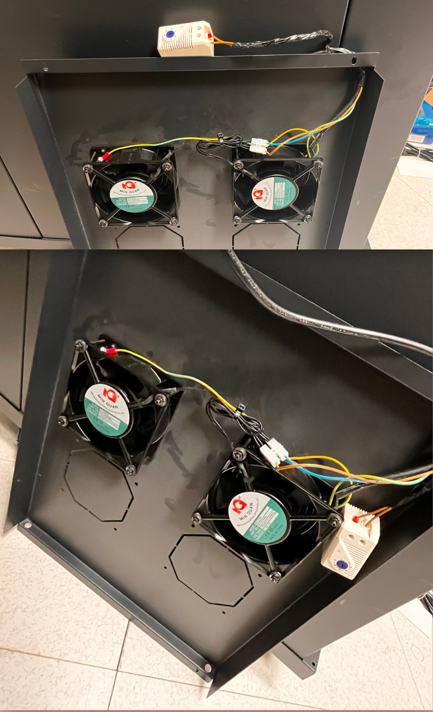
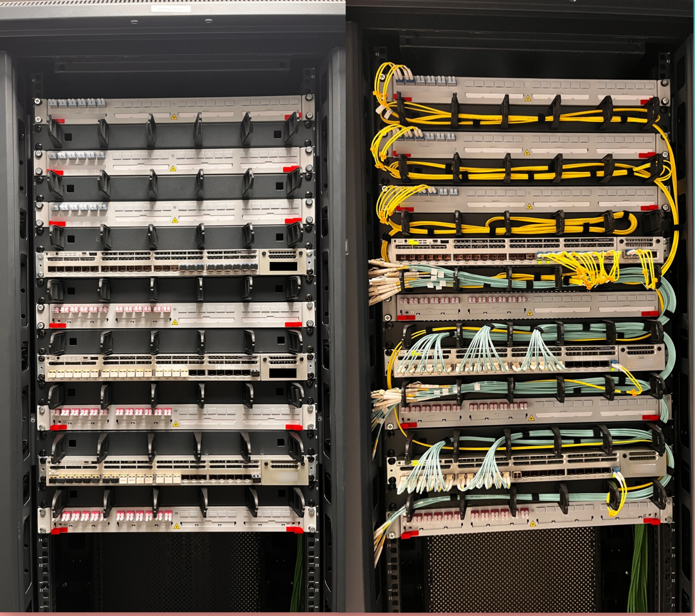
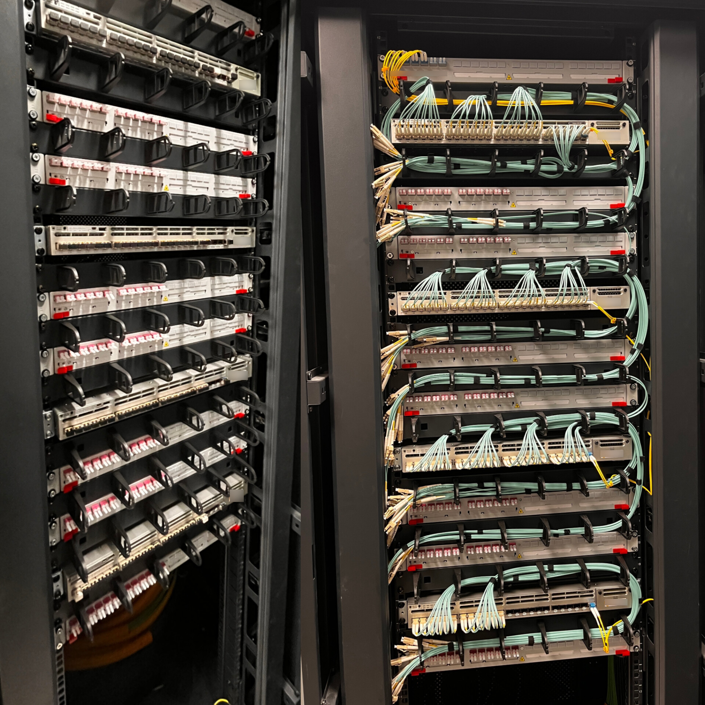
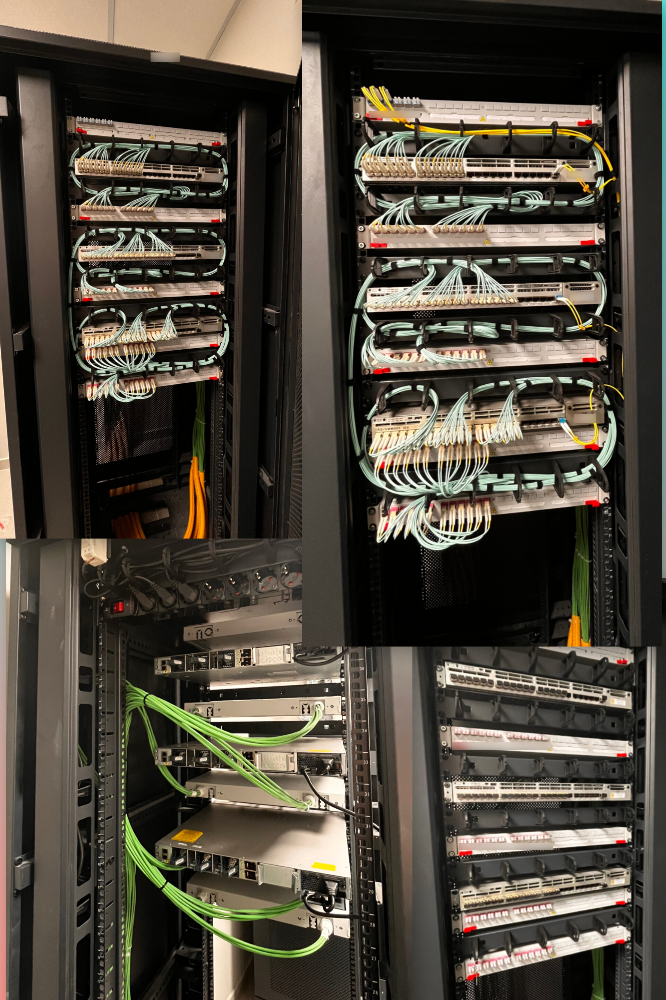
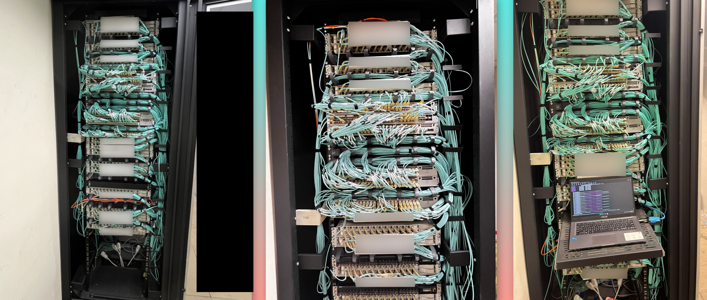

# 🏗️ Greenfield Network Infrastructure & Rack Builds

Welcome to my **Greenfield Infrastructure Engineering** showcase! As a **CCNA Certified Systems & Network Infrastructure Engineer**, I design and build enterprise network environments from the ground up (scratch). 

This repository highlights end-to-end computer room deployments—from raw rack assembly, thermal/electrical wiring, and structured cabling, to the provisioning of **Cisco Catalyst 9300 Series Switches** operating with **20 Gbps EtherChannel uplinks**.

---

## 🚀 Greenfield Deployment Lifecycle (From 0 to Production)

Building a reliable computer room infrastructure requires precision at every layer of physical and logical design:

1. **Physical Enclosure & Thermal Control:**
   * Cabinet positioning, grounding, and structural alignment.
   * Integration of thermal control systems (roof fan trays wired to adjustable analog thermostats) to maintain ambient operating temperatures.
2. **Electrical & Power Distribution (PDU):**
   * Installation of top-of-rack (ToR) Power Distribution Units (PDUs).
   * Neat routing and strain relief of power cables separated from data lines to avoid Electromagnetic Interference (EMI).
3. **Structured Fiber & Copper Cabling:**
   * Mounting 1U/2U horizontal cable managers and patch panels.
   * Precision dressing of High-Density Multimode (OM3/OM4 aqua) and Single-Mode (OS2 yellow) fiber patch cords with strict bend-radius adherence.
4. **Active Hardware Provisioning (Cisco Enterprise):**
   * Rack-mounting **Cisco Catalyst 9300 Series** enterprise switches.
   * Provisioning high-speed uplinks using **LACP / EtherChannel aggregation (20 Gbps bandwidth)** for high availability and load balancing.

---

## 📸 Greenfield Project Gallery

### 🛠️ Step 1: Enclosure Thermal Management & Electrical Wiring

* **Description:** Custom wiring and mounting of an overhead cabinet cooling system. Dual AC fan units are integrated with an adjustable mechanical thermostat to automatically activate active exhaust when internal rack temperatures cross operational thresholds.

---

### 🛠️ Step 2: Chassis Mount & Fiber Patching (Front View)

* **Description:** Transition from bare cabinet framework with horizontal Panduit managers (left) to a fully dressed High-Density Fiber Distribution Node (right). Single-mode OS2 (yellow) and OM3/OM4 (aqua) jumpers are routed without physical tension.

---

### 🛠️ Step 3: High-Density Fiber Dressing & Routing

* **Description:** Side-by-side view showing precise cable geometry. Fiber patch cords are cleanly looped into vertical managers, maintaining optimal bend radius to eliminate optical attenuation across high-speed link drops.

---

### 🛠️ Step 4: Power Distribution (PDU) & Rear Trunk Cabling

* **Description:** Rear and front integration of the cabinet. Features top-mounted Rack PDUs powering Cisco hardware, paired with neatly bundled green inter-cabinet trunk feeds routed flush along the cabinet chassis legs.

---

### 🛠️ Step 5: Commissioning, Console Configuration & EtherChannel Provisioning

* **Description:** On-site deployment station during switch stack commissioning. Executing Cisco IOS-XE CLI configurations, setting up VLAN trunks, STP root guard, security hardening, and validating **20 Gbps LACP EtherChannel uplinks**.

---

## 🛠️ Technical Competencies & Standards Applied

* **Switching Architecture:** Cisco Catalyst 9300 Stacking, LACP / EtherChannel (20 Gbps link aggregation), 802.1Q VLAN Trunking, Spanning Tree (Rapid-PVST+).
* **Physical Infrastructure:** TIA/EIA-568 standards, Fiber Optic LC/SC termination, Cable Dressing, Rack Thermal/Airflow Optimization.
* **Testing & Tools:** Console CLI diagnostic scripts, SFP/SFP+ optical power testing, Port audit & mapping.
