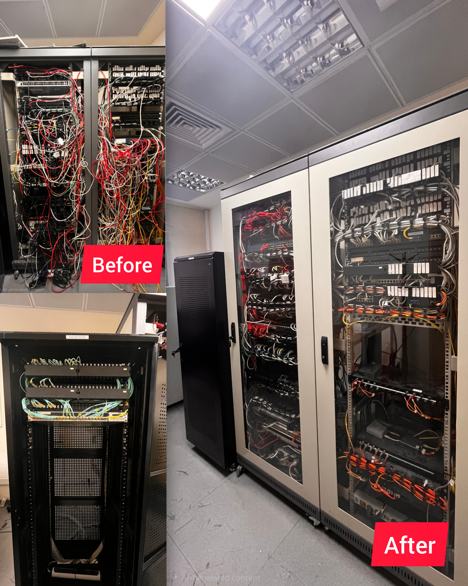
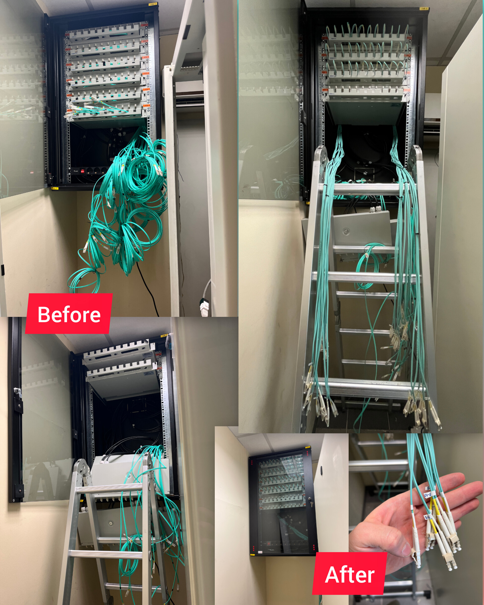
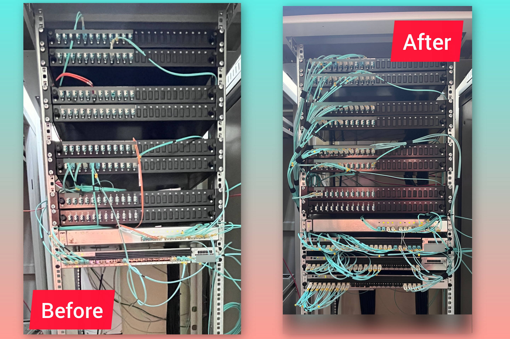

# 🔌 Network Infrastructure & Rack Transformations
 
Welcome to my Infrastructure Engineering showcase! As a **CCNA Certified Network & Systems Infrastructure Engineer**, I specialize in stepping into legacy server rooms, identifying poor installations or hardware clutter left behind by previous setups, and executing full physical and logical transformations.

This repository demonstrates a **selected sample** of my real-world rack cleanups, cable management projects, and hardware modernizations.

---

## 🎯 What I Do (Full-Stack Infrastructure Engineering)

When I walk into a server room or datacenter space, my goal is to deliver a reliable, secure, and easily maintainable environment across the entire **OSI Model**:

* **OSI Layers 1–2 (Physical & Data Link):**
  * Auditing legacy cabling, tracing rogue runs, and replacing tangled patch cords with structured Cat6A/OM4 connections.
  * Fiber optic management (ODF trays, fusion splicing, and enforcing bend-radius standards).
  * Layer 2 switching setup: VLAN tagging, Trunking, Spanning Tree Protocol (STP), and Port Security.
* **OSI Layers 3–5 (Network, Transport & Session):**
  * Core Cisco configuration: Cisco Switches (Catalyst series) and Cisco Enterprise Routers.
  * IP Routing protocols (OSPF, Static Routing), Subnetting, NAT, and Access Control Lists (ACLs).
  * Firewall deployment, VPN tunnels, and transport layer traffic management.

---

## 💡 Why Clean Physical Infrastructure Matters for Employers

A messy server room isn't just an aesthetic issue—it's an **operational risk**. Re-architecting and cleaning physical racks yields immediate benefits:

1. **Faster Troubleshooting & Reduced Downtime:** When an outage occurs, a well-labeled and color-coded rack allows engineers to trace physical faults in seconds rather than hours.
2. **Optimal Airflow & Thermal Efficiency:** Clearing "cable forests" unblocks server exhaust vents, preventing thermal throttling and hardware degradation.
3. **Accidental Disconnection Prevention:** Removing heavy, dangling cable strain stops ports and SFPs from loose connections or physical failure.

---

## 📜 What a CCNA Engineer Brings to the Table

Holding a **Cisco Certified Network Associate (CCNA)** certification proves rigorous hands-on competence in:

* **CLI Proficiency:** Native mastery of Cisco IOS/IOS-XE command-line syntax for configuration and rapid diagnostic debugging.
* **Network Automation & Scripting:** Utilizing Python, Netmiko, and SSH automation to push bulk backups and configuration updates.
* **Security & Hardening:** Enforcing AAA, disabling unused ports, configuring SSH access, and locking down network control planes.
* **High Availability:** Configuring redundant topologies (HSRP, EtherChannel/LACP) to eliminate single points of failure.

---

## 📸 Project Gallery & Real-World Demonstrations

*Note: The photos below represent a small portion of the infrastructure projects I have executed.*

### 🛠️ Rack Transformation 1: High-Density Patch Panel & Switch Overhaul

* **Challenge:** Severe cable clutter involving hundreds of red and white Ethernet drops, preventing port tracing and obstructing rack doors.
* **Solution:** Installed horizontal Panduit cable managers, replaced oversized patch cords with precise-length cabling, organized color-coded VLAN paths, and secured bundles using industrial hook-and-loop (velcro) straps.

---

### 🛠️ Rack Transformation 2: Enterprise Data Center Multi-Cabinet Standardization

* **Challenge:** Multiple server cabinets suffering from "cable waterfalls" that disrupted airflow, created physical tension on SFP modules, and slowed down system auditing.
* **Solution:** Full physical restructuring of multi-rack enclosures. Routed inter-cabinet links through dedicated overhead/side raceways, improved thermal performance, and closed cabinet doors for a clean, production-ready environment.

  

---

### 🛠️ Rack Transformation 3: Data Center Main Distribution Frame (MDF) Row Cleanup

* **Challenge:** A full row of legacy cabinets with hazardous dangling cabling hanging into walkways and obstructing emergency maintenance access.
* **Solution:** Comprehensive recabling of the entire MDF row. Bundled trunk lines along chassis frames, applied strict TIA/EIA labeling standards, and drastically improved overall facility safety and troubleshooting speed.

  

---

### 🛠️ Rack Transformation 4: Mixed Copper & Fiber Core Rack Optimization

* **Challenge:** High-density rack with tangled aqua OM3/OM4 fiber jumpers and copper patch cords blocking equipment exhaust vents and switch ports.
* **Solution:** Rerouted optical fiber lines through vertical cable channels to prevent bend-radius attenuation, bundle-dressed Ethernet runs, and restored clear visibility across all Cisco switches and ODF panels.

---

### 🛠️ Rack Transformation 5: Wall-Mounted Fiber Enclosure Splicing & Termination

* **Challenge:** Loose, un-terminated fiber optic strands hanging out of a wall-mounted enclosure in a remote distribution node.
* **Solution:** Performed precision optical fiber splicing, labeled all individual fiber strands for circuit identification, neatly coiled excess buffer tubes inside the splice tray, and secured the wall cabinet.

  

---

### 🛠️ Rack Transformation 6: Fiber Optic Distribution Frame (ODF) & SFP+ Alignment

* **Challenge:** Disorganized multimode fiber jumpers placing stress on SFP/SFP+ optical transceivers and risking glass core micro-fractures.
* **Solution:** Cleaned and polished optical connectors, properly seated LC fiber patches into high-density ODF trays, and routed uplinks with zero physical stress on high-speed Cisco switch uplinks.

  

---

## 🛠️ Tools & Equipment Mastered

* **Cisco Hardware:** Catalyst 9300/3850/2960 Switches, ISR Routers, CUCM / VoIP gateways.
* **Cabling & Testing:** Fluke Cable Analyzers, Fusion Splicers, Optical Power Meters, VFL Testers.
* **Management:** Hook-and-Loop (Velcro) straps, Cable Combs, Industrial Thermal Label Printers.
