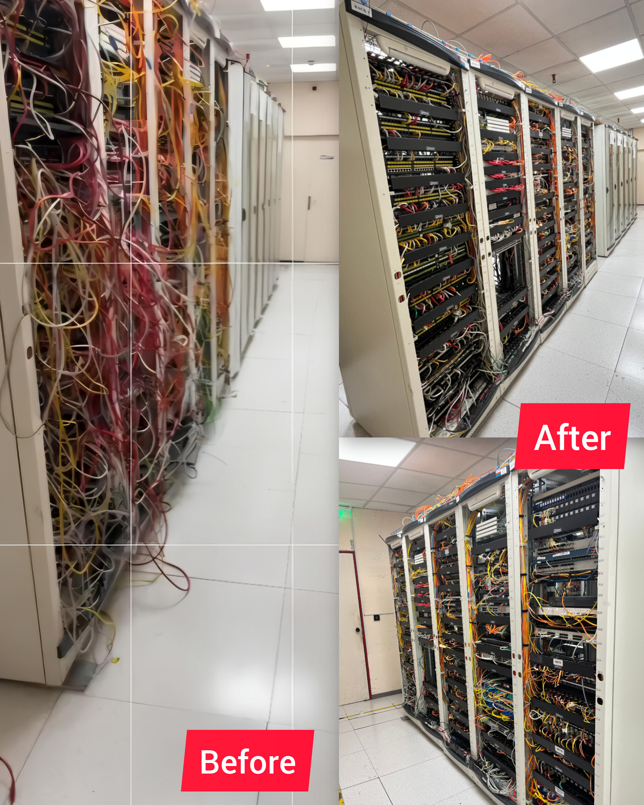
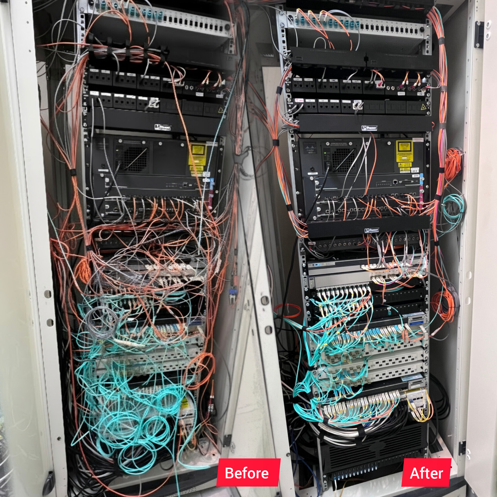

# 🔌 Network Infrastructure & Rack Transformations

Welcome to my Infrastructure Engineering showcase! As a **CCNA Certified Network & Systems Infrastructure Engineer**, I specialize in stepping into legacy server rooms, identifying poor installations or hardware clutter left behind by previous setups, and executing full physical and logical transformations.

This repository demonstrates a **selected sample** of my real-world rack cleanups, cable management projects, and hardware modernizations.

---

## 🎯 What I Do (Full-Stack Infrastructure Engineering)

When I walk into a server room or datacenter space, my goal is to deliver a reliable, secure, and easily maintainable environment across the entire **OSI Model**:

* **OSI Layers 1–2 (Physical & Data Link):**
  * Auditing legacy cabling, tracing rogue runs, and replacing tangled patch cords with structured Cat6A/OM4 connections.
  * Fiber optic management (ODF trays, fusion splicing, and enforcing bend-radius standards).
  * Layer 2 switching setup: VLAN tagging, Trunking, Spanning Tree Protocol (STP), and Port Security.
* **OSI Layers 3–5 (Network, Transport & Session):**
  * Core Cisco configuration: Cisco Switches (Catalyst series) and Cisco Enterprise Routers.
  * IP Routing protocols (OSPF, Static Routing), Subnetting, NAT, and Access Control Lists (ACLs).
  * Firewall deployment, VPN tunnels, and transport layer traffic management.

---

## 💡 Why Clean Physical Infrastructure Matters for Employers

A messy server room isn't just an aesthetic issue—it's an **operational risk**. Re-architecting and cleaning physical racks yields immediate benefits:

1. **Faster Troubleshooting & Reduced Downtime:** When an outage occurs, a well-labeled and color-coded rack allows engineers to trace physical faults in seconds rather than hours.
2. **Optimal Airflow & Thermal Efficiency:** Clearing "cable forests" unblocks server exhaust vents, preventing thermal throttling and hardware degradation.
3. **Accidental Disconnection Prevention:** Removing heavy, dangling cable strain stops ports and SFPs from loose connections or physical failure.

---

## 📜 What a CCNA Engineer Brings to the Table

Holding a **Cisco Certified Network Associate (CCNA)** certification proves rigorous hands-on competence in:

* **CLI Proficiency:** Native mastery of Cisco IOS/IOS-XE command-line syntax for configuration and rapid diagnostic debugging.
* **Network Automation & Scripting:** Utilizing Python, Netmiko, and SSH automation to push bulk backups and configuration updates.
* **Security & Hardening:** Enforcing AAA, disabling unused ports, configuring SSH access, and locking down network control planes.
* **High Availability:** Configuring redundant topologies (HSRP, EtherChannel/LACP) to eliminate single points of failure.

---

## 📸 Project Gallery & Real-World Demonstrations

*Note: The photos below represent a small portion of the infrastructure projects I have executed.*

### 🛠️ Rack Transformation 1: Server Room Cleanup

*Figure 1: Tracing and auditing legacy drops, removing unneeded jumpers, and applying structured horizontal cable management.*

---

### 🛠️ Rack Transformation 2: Core Distribution & Cisco Switching

*Figure 2: Re-cabling Cisco Catalyst switches with custom-length patch cables, organized by service VLANs.*

---

### 🛠️ Rack Transformation 3: High-Density Patching & Fiber ODF

*Figure 3: Clean patch panel distribution with fiber optic tray routing, preventing bend radius losses.*

---

### 🛠️ Rack Transformation 4: Power & Cable Dressing

*Figure 4: Rear-rack cable dressing and PDU power delivery separation to eliminate EMI (Electromagnetic Interference).*

---

### 🛠️ Rack Transformation 5: Completed Server Room Upgrade

*Figure 5: Fully transformed server rack with zero dangling cables, documented ports, and unobstructed thermal airflow.*

---

### 🛠️ Rack Transformation 6: Final Compliance Check

*Figure 6: Completed deployment ready for production uptime, monitoring (Zabbix/PRTG), and easy long-term maintenance.*

---

## 🛠️ Tools & Equipment Mastered

* **Cisco Hardware:** Catalyst 9300/3850/2960 Switches, ISR Routers, CUCM / VoIP gateways.
* **Cabling & Testing:** Fluke Cable Analyzers, Fusion Splicers, Optical Power Meters, VFL Testers.
* **Management:** Hook-and-Loop (Velcro) straps, Cable Combs, Industrial Thermal Label Printers.
