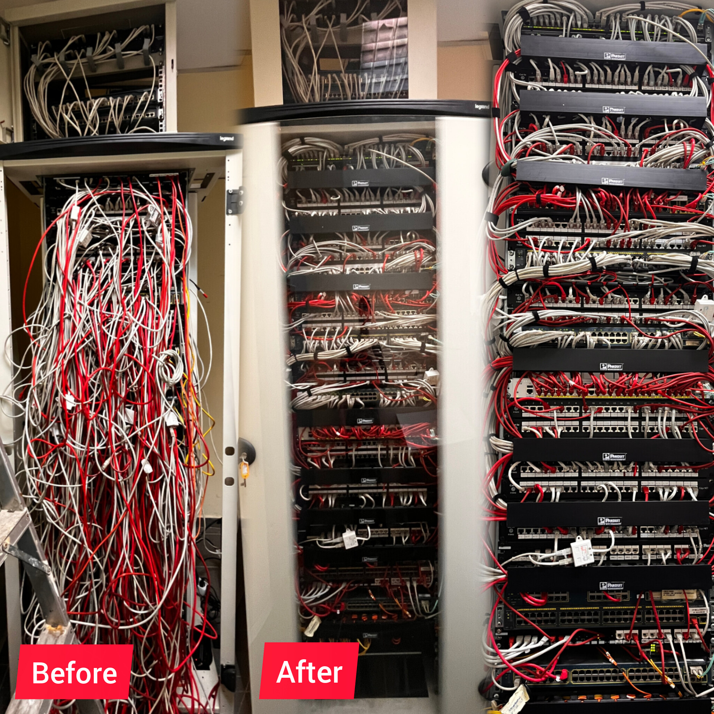

# 🔌 Network Infrastructure & Rack Transformations

A curated collection of rack cleanup, cable management, and infrastructure modernization projects. This document highlights technical rebuilds focused on improving network reliability, airflow efficiency, cable labeling, and troubleshooting response times.

---

## 📌 Project Overview & Scope

Over time, server rooms and distribution racks accumulate patch cord clutter, loose fiber jumpers, and unlabeled drops. These transformations focus on:

* **Structured Cabling Standards:** Adhering to TIA/EIA-568 color-coding standards.
* **Cable Management:** Replacing tangled patch cords with custom-length cabling and Velcro straps (no zip ties on data/fiber).
* **Fiber Optic Integrity:** Proper bend radius management in Optical Distribution Frames (ODF) and splice trays.
* **Airflow & Thermal Management:** Clearing obstructed intake/exhaust pathways to lower ambient equipment temperatures.
* **Port Documentation:** Clear labeling on patch panels, switches, and power distribution units (PDUs).

---

## 🛠️ Case Studies & Transformations

### 1. Central MDF Core Rack Rebuild

* **Location / Type:** Main Distribution Frame (MDF) / Core Server Room
* **Objective:** Re-cable a high-density core rack without disrupting active production services.
* **Key Tasks:**
  * Traced and audited 100+ legacy Cat6 drops.
  * Installed 24-Port Patch Panels and 1U horizontal cable managers.
  * Replaced mismatched patch cords with color-coded, slim Cat6A patch leads.
  * Cleared blocked rear exhaust zones for server chassis.

#### Before & After Comparison

| Legacy State (Tangled & Unlabeled) | Rebuilt State (Structured & Documented) |
| :---: | :---: |
|  |  |
|  |  |

---

### 2. Intermediate IDF Distribution Rack & Fiber Uplinks

* **Location / Type:** Intermediate Distribution Frame (IDF)
* **Objective:** Clean up distribution switching and dress incoming multimode fiber uplinks.
* **Key Tasks:**
  * Cleaned and organized fiber optic splice trays (ODF).
  * Routed LC-LC OM4 fiber patch cords through dedicated vertical wire managers.
  * Organized dual PDU power runs for redundant switch power supplies.

#### Before & After Comparison

| Legacy State | Rebuilt State |
| :---: | :---: |
|  |  |

---

## 🏷️ Standards & Color-Coding Schema

To ensure rapid troubleshooting, the following cable coloring scheme was implemented across all rebuilds:

| Cable Color | Service / VLAN Assignment |
| :--- | :--- |
| 🔵 **Blue** | Data / Workstation Drops (VLAN 10) |
| 🟡 **Yellow** | IP Telephony / VoIP (CUCM / PBX) |
| 🔴 **Red** | Infrastructure Management & iLO / iDRAC |
| 🟢 **Green** | Security / IP Cameras & Access Control |
| 🟠 **Orange / Aqua** | OM3 / OM4 Fiber Optic Uplinks |

---

## 🧰 Hardware & Tools Used

* **Network Hardware:** Cisco Catalyst 9300/3850 Series, TP-Link JetStream Switches, Patch Panels.
* **Fiber Equipment:** Fusion Splicer, ODF Trays, LC/SC Fiber Jumpers, Visual Fault Locator (VFL).
* **Cable Management:** Hook-and-Loop (Velcro) straps, 1U/2U Horizontal Cable Managers, D-Rings, Cable Combs.
* **Testing & Labeling:** Fluke CableAnalyzer / Wiremapper, Industrial Label Printer.

---

## 📈 Key Results & Impact

* ⏱️ **Troubleshooting Speed:** Reduced cable tracing and MAC (Moves, Adds, Changes) time by ~70%.
* 🌡️ **Thermal Performance:** Improved rack airflow, lowering switch intake temperatures.
* 🔒 **Reliability:** Eliminated accidental link disconnections caused by weight strain on switch ports.

